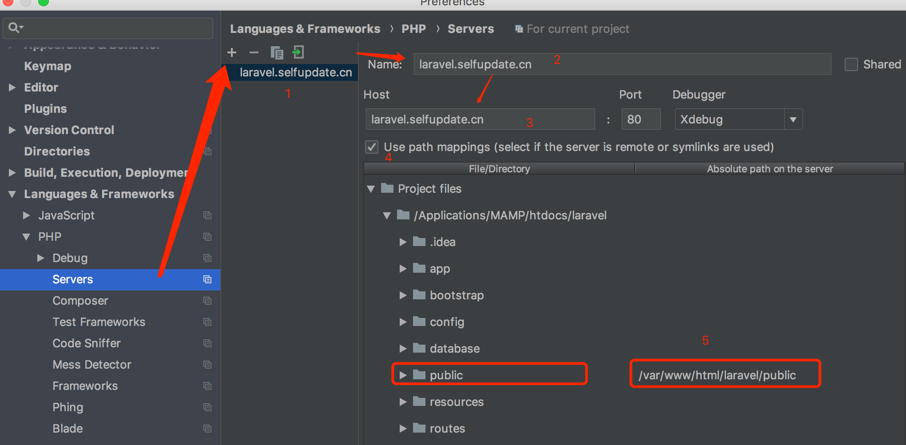
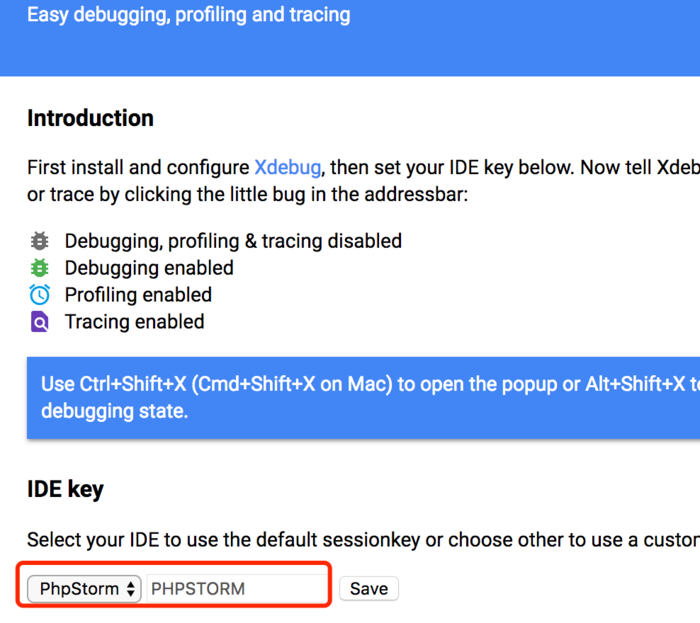

# xdebug
## Xdebug 介绍
Xdebug 是一个可以用来对 PHP 进行单步调试的扩展（还能进行性能分析等其他操作），使用 Xdebug 时通常包含两部分：php xdebug扩展、xdebug 调试器插件（已经集成到 IDE 中）。它的原理如下图：


1. Xdebug 调试器插件开启调试，此时它会监听 PHP 服务器中 xdebug 发送来的数据。
2. 向 PHP 服务器发送 uri 请求，当 PHP 的 Xdebug 模块检测到请求需要开启调试时（通常 cookie 中包含 XDEBUG_SESSION 字段），Xdebug 将请求的响应挂起，并进入调试模式（收集 PHP 当前的运行数据）。
3. Xdebug 根据配置与 xdebug 调试器建立连接（遵循 BGDp 协议），将收集到的运行数据发送到 remote_host.remote_port ，你在调试器中就能看到当前断点的运行数据了。
4. 单步调试直至结束，PHP 服务器返回响应数据。

## 安装
#### 安装类库
````
apk add --no-cache php7-xdebug
````

#### 设置 php.ini，在php.ini最后添加
````
vim /etc/php7/conf.d/xdebug.ini

[Xdebug]
zend_extension = xdebug.so
xdebug.remote_enable = 1
xdebug.remote_host = localhost
xdebug.remote_port = 9000
xdebug.idekey = PHPSTORM
````

#### 重启php-fpm
````
supervisorctl restart php-fpm7
````

#### 测试
````
php -m | grep Xdebug
````
输出 Xdebug 则代表安装成功

## PhpStorm 配置
#### 配置Servers
`host` 为你 url 访问的地址，`port` 为你 url 的端口。如果使用了服务器在虚拟机中（如vagrant）或 Docker 中，需要配置 mapping，将所访问项目的实际目录对应到虚拟机中目录。



#### 开始调试
1. 点击 PhpStorm 中 Run -> Start Listening for PHP Debug Connections，让 Xdebug 调试器监听服务端 Xdebug 发送回来的运行数据。
2. 安装浏览器 Xdebug helper 插件，并设置 IDE key 内容为 xdebug.ini 中的 xdebug.idekey 的值（请求中需要这个内容，才能触发 xdebug 扩展处理）。
并开启 debug。
3. 在浏览器中访问你需要调试的请求。
   在请求的Cookie中能看见 XDEBUG_SESSION 内容。

## 其它说明
在 Mac 中使用 Docker 时，remote_host 不能配置为 127.0.0.1，因为容器中不能直接通过 127.0.0.1 访问容器的主机。

网上的解决方法是：
     
1. 在主机中执行：
    ````
    ifconfig lo0 alias 10.254.254.254
    ````
2. 将 xdebug.ini 中的 remote_host 配置为 10.254.254.254，即可。

如果你的 PHP 没有断点成功，多半是 xdebug 的数据没有传送到 Xdebug 调试器，可以打开 xdebug.remote_log 看下具体的错误内容。

## [DBGP 多人调试](https://www.cnblogs.com/jice/p/5064838.html)
### 服务器DBGP安装
todo

### 路由器配置
1. 地址保留（局域网IP设置）：保证一个开发者局域网IP不变
1. 端口映射：用于将局域网机器暴露到公网